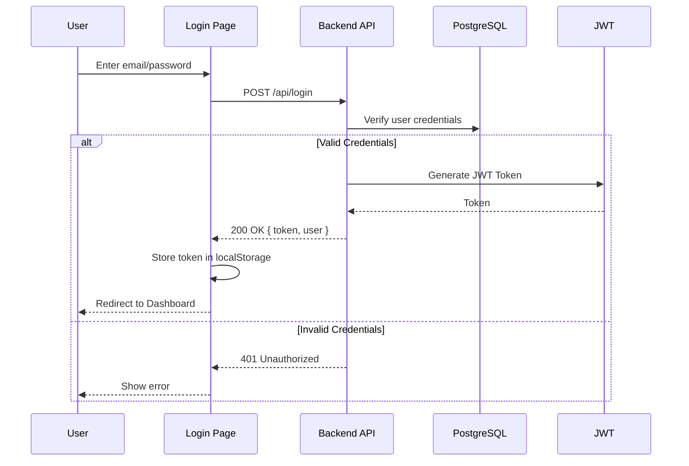
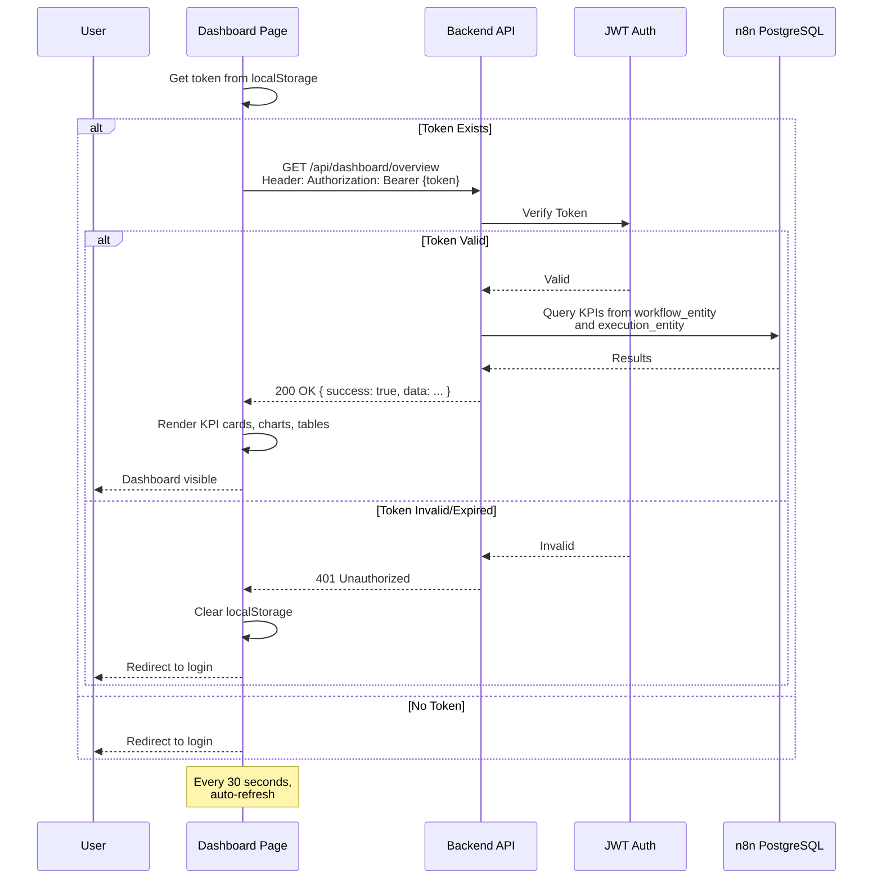

# TaskyHub - Application Architecture
This document covers the **application-level architecture of TaskyHub, including metrics, health scoring, and data flows.

---

## Table of Contents
1. [KPIs & Metrics Calculation](#kpis--metrics-calculation)
2. [Workflow Health Scoring Algorithm](#workflow-health-scoring-algorithm)
3. [Application Stack](#application-stack)
4. [Data Flow Diagrams](#data-flow-diagrams)

---

## KPIs & Metrics Calculation

### Success Rate
```
Success Rate = (Number of Successful Executions / Total Executions) × 100
```
- Successful Executions: Count of executions where `status = 'success'` in `execution_entity`
- Total Executions: Count of all records in `execution_entity`

### Failure Rate
```
Failure Rate = (Number of Failed Executions / Total Executions) × 100
```
- Failed Executions: Count of executions where `status = 'error'` in `execution_entity`

### Average Execution Time
```
Average Execution Time = AVG(EXTRACT(EPOCH FROM ("stoppedAt" - "startedAt")) × 1000
```
- Calculated in milliseconds
- Only considers executions where `stoppedAt IS NOT NULL` (completed executions)

### Average Workflow Health Score
```
Average Workflow Health Score = (Sum of all individual workflow health scores) / Total number of workflows
```
- Each workflow's health score calculated via health scoring algorithm
- Rounded to nearest integer

---

## Workflow Health Scoring Algorithm

Each workflow's health score is calculated out of 100, with four possible health categories:

### Health Categories
| Health Score | Category    | Color  |
|--------------|-------------|--------|
| ≥ 90         | Excellent   | Green  |
| 70 - 89      | Healthy     | Blue   |
| 50 - 69      | Warning     | Yellow |
| < 50         | Critical    | Red    |

### Scoring Formula
The health score is a weighted sum of three factors:

| Factor               | Weight | Calculation                                                                 |
|----------------------|--------|-----------------------------------------------------------------------------|
| Success Rate         | 50%    | Directly uses the success rate percentage                                  |
| Average Runtime      | 20%    | - ≤ 30 seconds: +20 points<br>- ≤ 60 seconds: +10 points<br>- > 60 seconds: 0 points |
| Failure Rate         | 30%    | - < 5%: +30 points<br>- 5% - 14%: +15 points<br>- ≥ 15%: 0 points      |

### Example Calculations
**Example 1: Excellent Health**
- Success Rate: 98% → contributes 49 points (98 × 0.5)
- Avg Runtime: 12 seconds → contributes 20 points
- Failure Rate: 2% → contributes 30 points
- **Total Score: 99/100 → Excellent**

**Example 2: Warning Health**
- Success Rate: 70% → contributes 35 points (70 × 0.5)
- Avg Runtime: 45 seconds → contributes 10 points
- Failure Rate: 12% → contributes 15 points
- **Total Score: 60/100 → Warning**

---

## Application Stack

```mermaid
graph TD
    subgraph "Frontend (TaskyHub UI)"
        A[Dashboard - Overview]
        B[Dashboard - Workflows]
        C[Dashboard - Failures]
        D[Dashboard - Insights]
        E[Login Page]
    end

    subgraph "Backend API"
        F[Express.js Server]
        G[Auth Middleware<br/>JWT Verification]
        H[Endpoints:<br/>/api/dashboard/*<br/>/api/workflows<br/>/api/executions<br/>/api/users]
    end

    subgraph "n8n & Monitoring"
        I[n8n<br/>Workflow Engine]
        J[(n8n PostgreSQL DB<br/>workflow_entity<br/>execution_entity)]
        K[Grafana<br/>Analytics Dashboards]
    end

    A <-->|API Requests (w/ JWT)| F
    B <-->|API Requests (w/ JWT)| F
    C <-->|API Requests (w/ JWT)| F
    D <-->|API Requests (w/ JWT)| F
    E <-->|Login & Auth| F
    
    F -->|Auth Check| G
    G -->|Validated| H
    H -->|Query Data| J
    K -->|Query Data| J
    I -->|Write Execution Data| J
```

### Key Components
1. **Frontend (Vanilla JS/HTML/CSS):
   - Dashboard sections: Overview, Workflows, Failures, Insights
   - Charts using Chart.js (line, doughnut)
   - Enterprise-grade glassmorphism UI
   - Real-time polling every 30 seconds

2. **Backend (Node.js/Express):
   - JWT-based authentication middleware
   - RESTful API endpoints for all analytics
   - PostgreSQL connection pooling
   - Error handling and logging

3. **n8n Stack:
   - n8n (workflow execution engine)
   - PostgreSQL (stores workflows, executions)
   - Grafana (visualization dashboards)

---

## Data Flow Diagrams

### 1. User Login Flow


### 2. Dashboard Overview Flow

