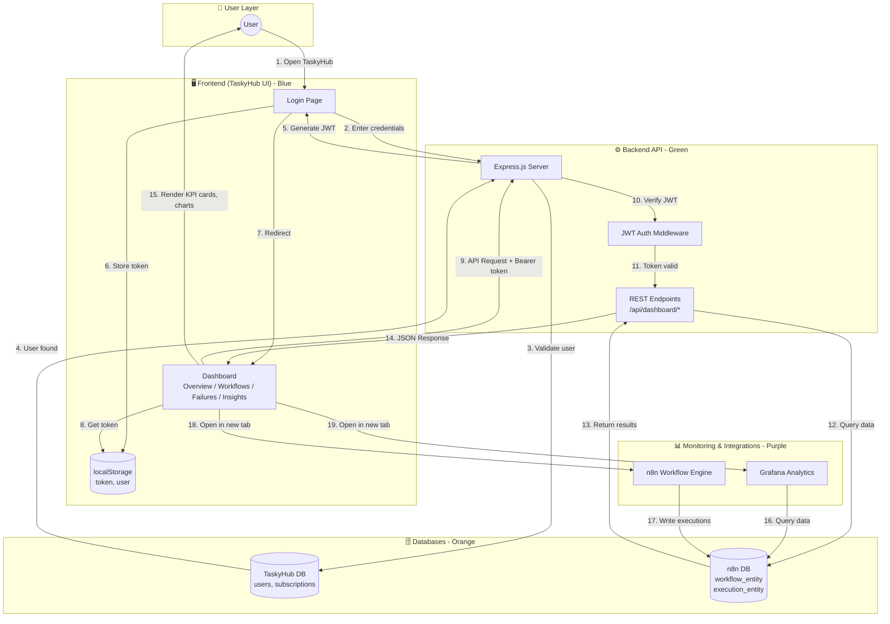
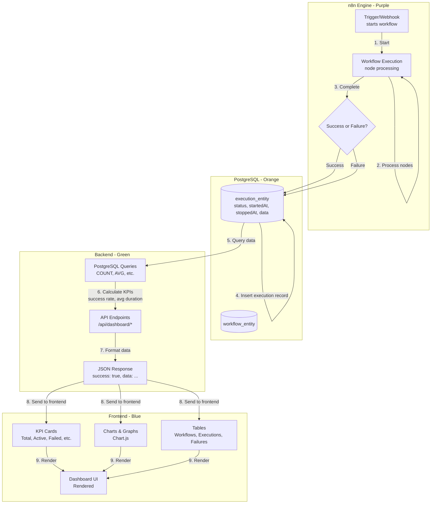
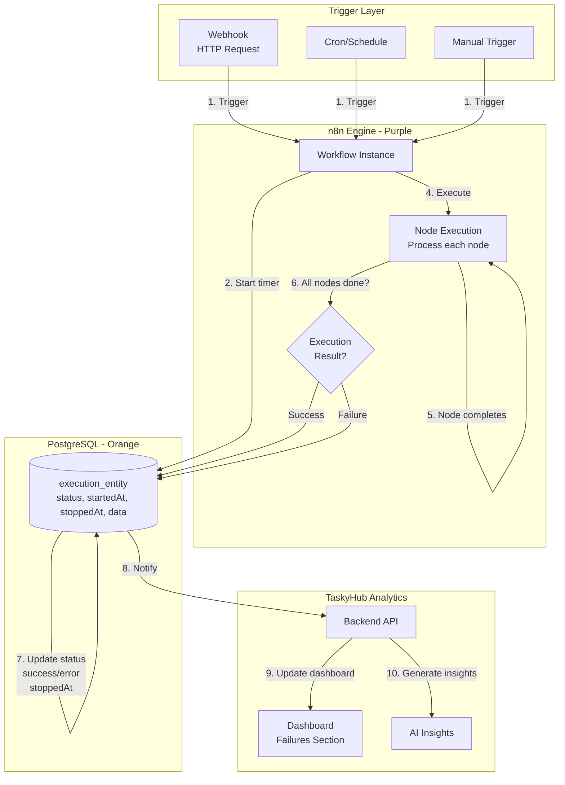
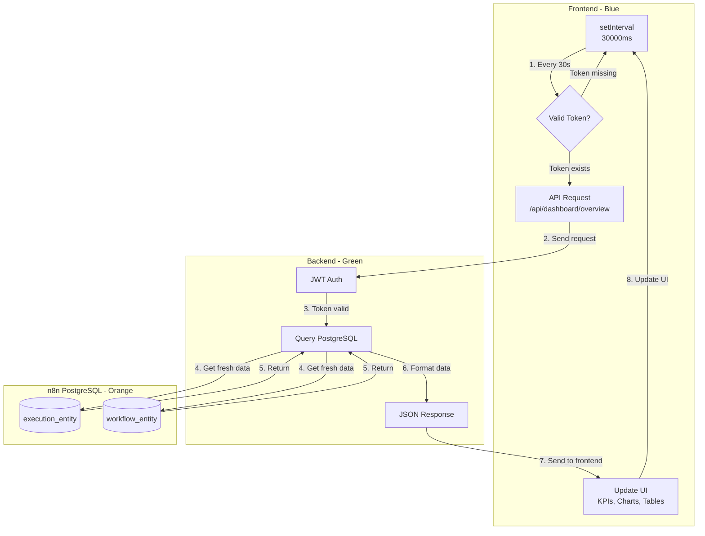
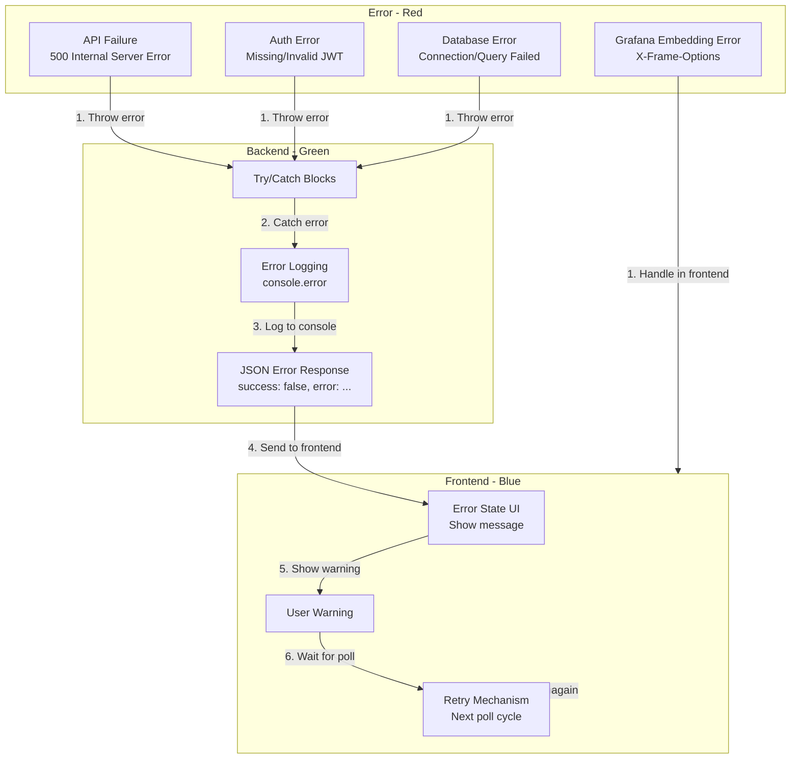
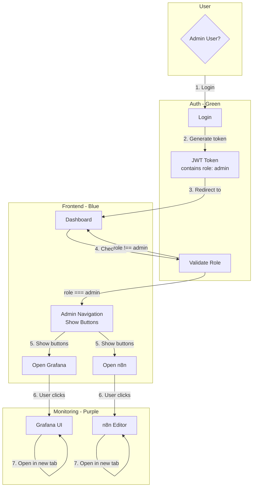
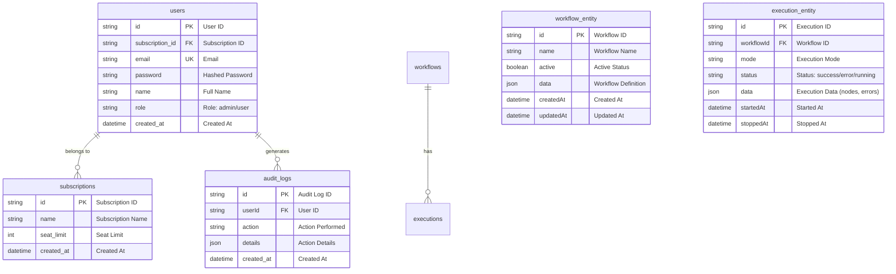

# TaskyHub - Complete Architecture & Data Flow Diagrams
All diagrams are created using **Mermaid.js**, which supports:
- GitHub/GitLab rendering
- VS Code preview
- Export to PNG/SVG (via [Mermaid Live Editor](https://mermaid.live/))
- Draw.io compatible structure

---

## Table of Contents
1. [High-Level System Architecture](#1-high-level-system-architecture)
2. [End-to-End User Flow](#2-end-to-end-user-flow)
3. [Authentication Flow](#3-authentication-flow)
4. [Dashboard Analytics Flow](#4-dashboard-analytics-flow)
5. [Grafana Integration Flow](#5-grafana-integration-flow)
6. [n8n Workflow Execution Flow](#6-n8n-workflow-execution-flow)
7. [Real-Time Update Flow](#7-real-time-update-flow)
8. [Error Handling Flow](#8-error-handling-flow)
9. [Admin Access Flow](#9-admin-access-flow)
10. [Database ER Diagram](#10-database-er-diagram)

---

## Color Legend
| Section       | Color       |
|---------------|-------------|
| Frontend      | Blue        |
| Backend       | Green       |
| Database      | Orange      |
| Monitoring    | Purple      |
| Errors        | Red         |
| Admin         | Dark Gray   |

---

## 1. High-Level System Architecture


---

## 2. End-to-End User Flow
```mermaid
sequenceDiagram
    participant U as User
    participant L as Login Page
    participant D as Dashboard
    participant LS as localStorage
    participant BE as Backend API
    participant JW as JWT Auth
    participant PG as n8n PostgreSQL
    participant N as n8n
    participant G as Grafana

    Note over U,G: 1. Initial Visit
    U->>L: Open TaskyHub
    L->>LS: Check for token
    alt Token exists
        LS-->>L: Token found
        L->>D: Redirect to dashboard
    else No token
        LS-->>L: No token
        L-->>U: Show login form
    end

    Note over U,G: 2. Login
    U->>L: Enter email/password
    L->>BE: POST /api/login
    BE->>PG: Verify credentials (TaskyHub DB)
    PG-->>BE: User valid
    BE->>BE: Generate JWT Token
    BE-->>L: 200 OK { token, user }
    L->>LS: Store tasky_token & tasky_user
    L->>D: Redirect to dashboard

    Note over U,G: 3. Dashboard Load
    D->>LS: Get JWT token
    D->>BE: GET /api/dashboard/overview<br/>Authorization: Bearer {token}
    BE->>JW: Verify token
    alt Token valid
        JW-->>BE: Valid
        BE->>PG: Query workflow_entity & execution_entity
        PG-->>BE: Return KPIs, executions, etc.
        BE-->>D: 200 OK { success: true, data: ... }
        D->>D: Render KPI cards, charts, tables
        D-->>U: Dashboard visible
    else Token invalid/expired
        JW-->>BE: Invalid
        BE-->>D: 401 Unauthorized
        D->>LS: Clear localStorage
        D->>L: Redirect to login
    end

    Note over U,G: 4. Real-Time Updates
    loop Every 30 seconds
        D->>LS: Check token
        alt Token exists
            D->>BE: Refresh dashboard data
            BE->>PG: Query updated data
            PG-->>BE: Results
            BE-->>D: Updated JSON
            D->>D: Refresh charts & tables
        else Token missing
            break Stop polling
        end
    end

    Note over U,G: 5. Admin Actions
    alt User is admin
        D->>D: Show admin buttons (Open Grafana/n8n)
        U->>D: Click "Open Grafana"
        D->>G: Open in new tab
        U->>D: Click "Open n8n"
        D->>N: Open in new tab
    end
```

---

## 3. Authentication Flow
```mermaid
graph TD
    subgraph FRONTEND["Frontend - Blue"]
        LF[Login Form<br/>email + password]
        LS[(localStorage<br/>tasky_token)]
        DH[Dashboard<br/>Check token]
    end

    subgraph BACKEND["Backend - Green"]
        API[Express Server]
        JWTV[JWT Verification<br/>Middleware]
        LOG[POST /api/login]
        PROT[Protected Endpoints<br/>/api/dashboard/*]
    end

    subgraph DATABASE["Database - Orange"]
        TDB[(TaskyHub DB<br/>users table)]
    end

    LF -->|1. POST /api/login| LOG
    LOG -->|2. Query user| TDB
    TDB -->|3. User exists?| LOG
    alt User exists
        LOG -->|4. Verify password| LOG
        alt Password valid
            LOG -->|5. Generate JWT<br/>expiresIn: 8h| LOG
            LOG -->|6. Return token + user| LF
            LF -->|7. Store token| LS
            LF -->|8. Redirect| DH
            DH -->|9. Get token from LS| LS
            DH -->|10. API Request + Bearer token| API
            API -->|11. Pass to middleware| JWTV
            JWTV -->|12. Token valid?| JWTV
            alt Token valid
                JWTV -->|13. Proceed| PROT
                PROT -->|14. Return data| DH
            else Token invalid/expired
                JWTV -->|15. Return 401| API
                API -->|16. 401 Unauthorized| DH
                DH -->|17. Clear LS| LS
                DH -->|18. Redirect to login| LF
            end
        else Password invalid
            LOG -->|19. 401 Unauthorized| LF
            LF -->|20. Show error| LF
        end
    else User not found
        LOG -->|21. 401 Unauthorized| LF
        LF -->|22. Show error| LF
    end
```

---

## 4. Dashboard Analytics Flow


---

## 5. Grafana Integration Flow
```mermaid
graph TD
    subgraph DB["n8n PostgreSQL - Orange"]
        EE[(execution_entity)]
        WE[(workflow_entity)]
    end

    subgraph GRAFANA["Grafana - Purple"]
        DS[(PostgreSQL Datasource)]
        DASH[Grafana Dashboard<br/>taskyhub-overview]
        PANELS[Panels & Charts<br/>Stat, Line, Pie, Table]
    end

    subgraph FRONTEND["Frontend - Blue"]
        ADMIN{Is Admin?}
        G_BTN[Open Grafana Button]
        NEW_TAB[Open in New Tab]
    end

    DS -->|1. Query data| EE
    DS -->|1. Query data| WE
    EE -->|2. Return data| DS
    WE -->|2. Return data| DS
    DS -->|3. Pass to panels| PANELS
    PANELS -->|4. Render dashboard| DASH
    FRONTEND -->|5. Check user role| ADMIN
    alt User is admin
        ADMIN -->|6. Show button| G_BTN
        G_BTN -->|7. User clicks| NEW_TAB
        NEW_TAB -->|8. Navigate| DASH
    else User not admin
        ADMIN -->|9. Hide button| FRONTEND
    end
```

---

## 6. n8n Workflow Execution Flow


---

## 7. Real-Time Update Flow


---

## 8. Error Handling Flow


---

## 9. Admin Access Flow


---

## 10. Database ER Diagram


---

## Export Instructions
To export these diagrams:
1. Open [Mermaid Live Editor](https://mermaid.live/)
2. Paste the diagram code
3. Click "Actions" → "Export PNG" or "Export SVG"
4. For Draw.io compatibility, export as SVG and import into Draw.io

## File Organization
All architecture/infra/docs files are now:
- `docs/APPLICATION_ARCHITECTURE.md`: App-level details, KPIs, health scoring
- `docs/INFRASTRUCTURE_ARCHITECTURE.md`: Docker Compose & AWS Terraform infra
- `docs/ARCHITECTURE_DIAGRAMS.md`: This file - all diagrams!
- `SPECIFICATIONS_AND_ARCHITECTURE.md`: Original comprehensive specs (kept as reference)
