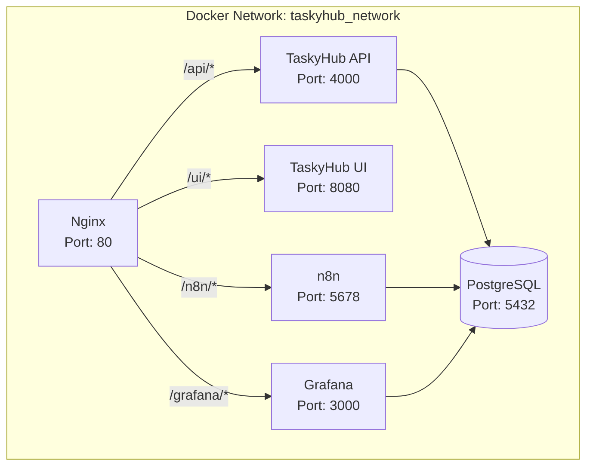
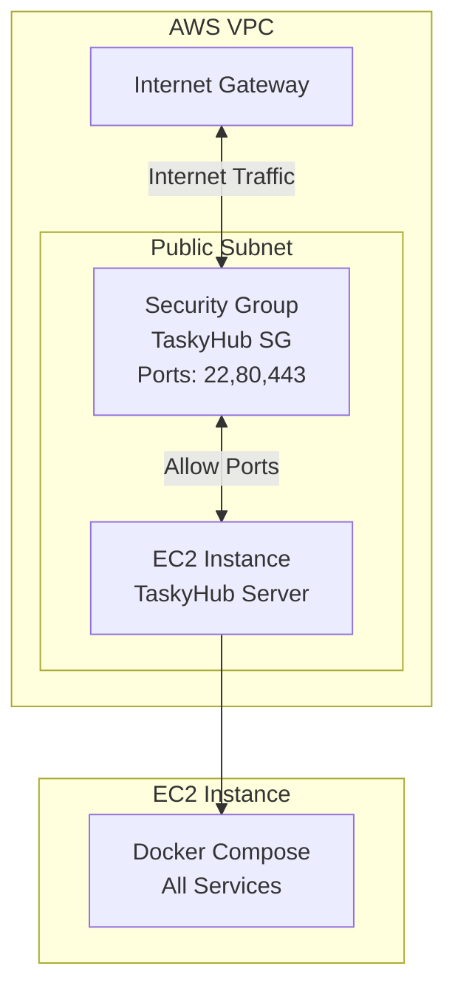

# TaskyHub - Infrastructure Architecture
This document covers TaskyHub's infrastructure, both **local (Docker Compose) and cloud (AWS Terraform).

---

## Table of Contents
1. [Local Development Environment (Docker Compose)](#local-development-environment-docker-compose)
2. [AWS Cloud Environment (Terraform)](#aws-cloud-environment-terraform)

---

## Local Development Environment (Docker Compose)

### Docker Services
All services run in a single Docker network named `taskyhub_network`:
1. **TaskyHub API**: Node.js Express server, exposes port 4000
2. **TaskyHub UI**: Static HTML/JS/CSS, served via Nginx or static server, exposes port 8080
3. **n8n**: Workflow engine, exposes port 5678
4. **PostgreSQL**: Single database instance for n8n, TaskyHub, and Grafana, exposes port 5432
5. **Grafana**: Visualization dashboards, exposes port 3000
6. **Nginx**: Reverse proxy, exposes port 80 and routes traffic to correct services

---

## AWS Cloud Environment (Terraform)

### High-Level Architecture

### Terraform Resources
Defined in `infra/terraform/main.tf`:
1. **aws_security_group.tasky_sg**: Security group allowing:
   - Port 22 (SSH, 0.0.0.0/0 - restrict in production!)
   - Port 80 (HTTP)
   - Port 443 (HTTPS)
   - All outbound traffic
2. **aws_instance.tasky_server**: EC2 instance running Amazon Linux 2, with user_data script that:
   - Installs Docker
   - Installs Docker Compose
   - Copies TaskyHub code
   - Starts all services with docker-compose up -d

### Outputs
Terraform outputs:
1. `instance_public_ip`: Public IP of the EC2 instance
2. `instance_id`: EC2 Instance ID
3. `security_group_id`: Security Group ID
