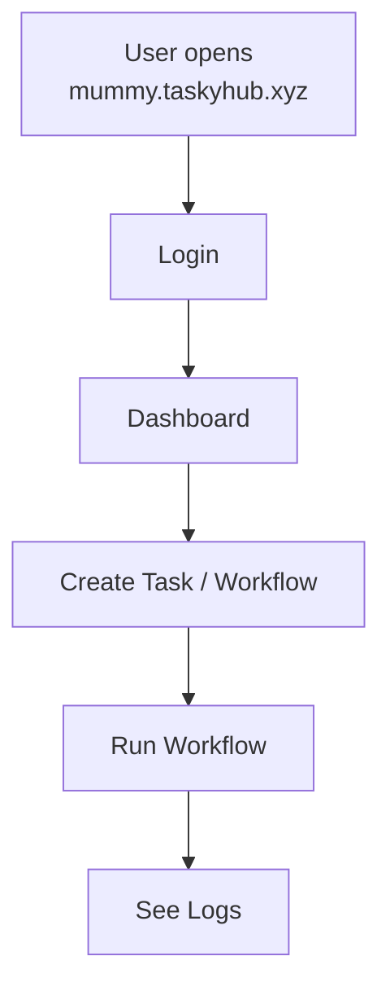

# Architecture Overview (Simple Diagrams)

## 1) Dataflow (High-Level)
One simple picture of how requests and data move through the system.

```mermaid
flowchart LR
  User --> Browser
  Browser -->|HTTPS| Nginx
  Nginx -->|/api| TaskyHub_API[TaskyHub API]
  TaskyHub_API --> Postgres

  TaskyHub_API --> AE[AE (n8n)]
  AE --> External[External APIs\n(WhatsApp, Email, etc.)]
```

## 2) Userflow (Login → Use Tasks/Flows)
What a user does step-by-step when using TaskyHub.



## 3) Application Architecture
The main app pieces and how they talk to each other.

```mermaid
flowchart LR
  UI[TaskyHub UI] -->|HTTPS /api| API[TaskyHub API]
  API --> DB[Postgres]
  API --> AE[AE (n8n)]
  AE --> EXT[External Services\n(WhatsApp, Email, etc.)]
  UI -->|View dashboards| G[Grafana]
  G --> DB
```

## 4) Infrastructure Architecture
Where everything runs in AWS and how domains reach the containers.

```mermaid
flowchart TB
  Internet[Domains\nmummy.taskyhub.xyz\nand ae.mummy.taskyhub.xyz] --> N[Nginx]

  subgraph AWS[AWS Account]
    subgraph VPC[VPC]
      subgraph EC2[AWS EC2 Instance (Docker Host)]
        N --> UI[TaskyHub UI (container)]
        N --> API[TaskyHub API (container)]
        N --> AE[AE (n8n) (container)]
        API --> DB[Postgres (container)]
        AE --> DB
        G[Grafana (container)] --> DB
      end
    end
  end
```
